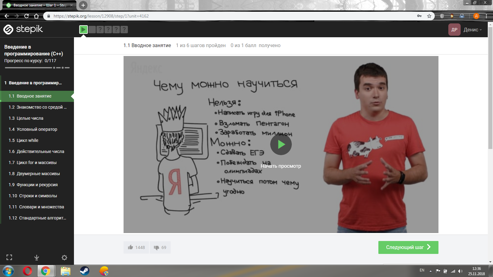

8.1.Участие в открытом онлайн курсе

Я принял участие в онлайн курсе
Введение в программирование (C++)
Время прохождения курса: 20 часов
Описание курса
Программа курса на базовом уровне освещает практические основы программирования. В ходе обучения предстоит решить множество небольших задач, охватывающих основные базовые конструкции языка C++. Такой опыт будет полезен всем, кто хочет углубиться в изучение программирования. Многие задачи курса были любезно предоставлены Денисом Кириенко, учителем московской школы 179.
Требования
Для усвоения материала потребуются базовые знания из школьной программы по математике.

